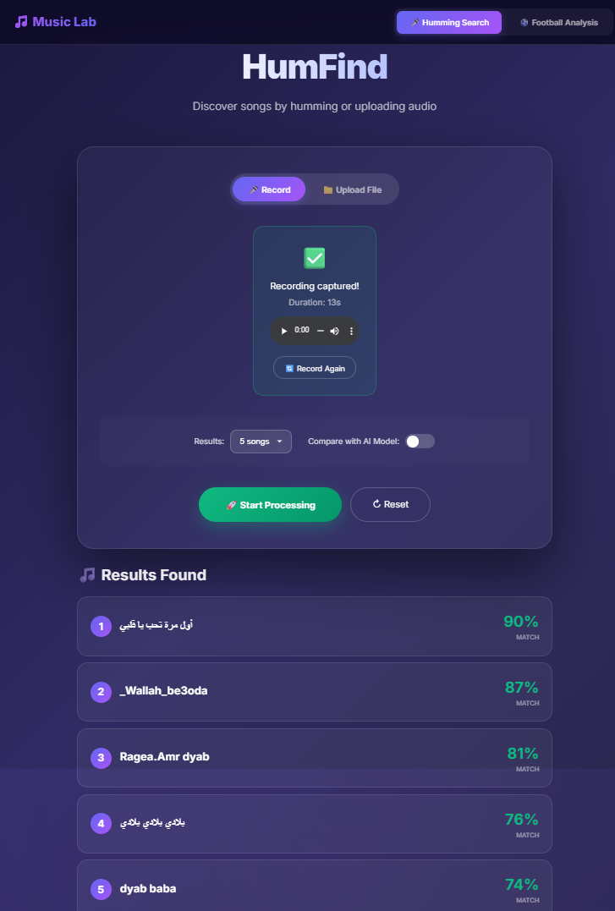
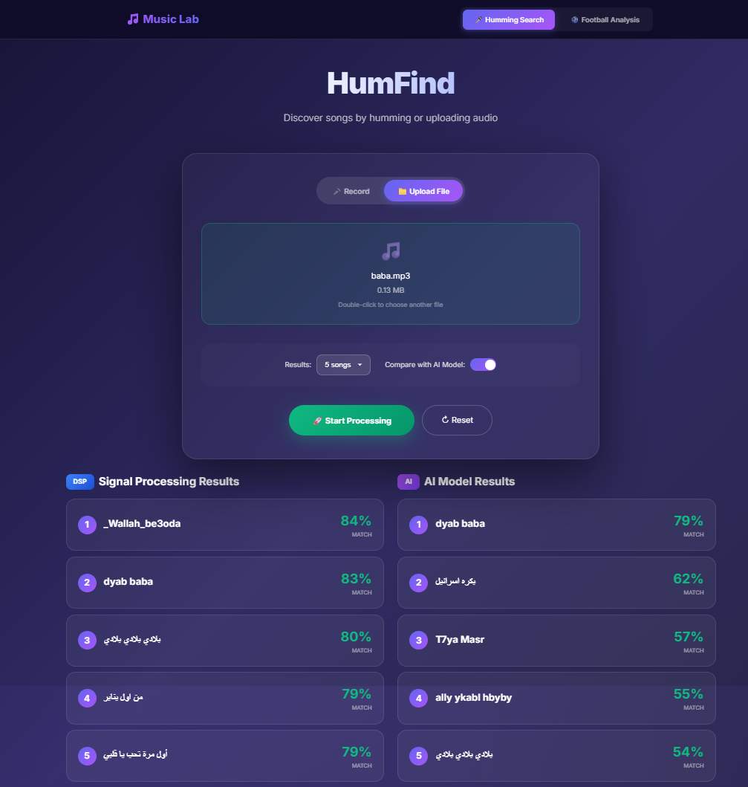
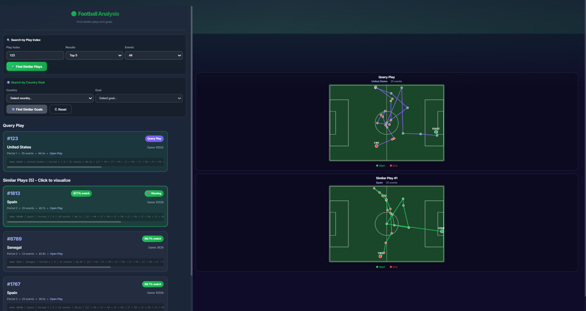
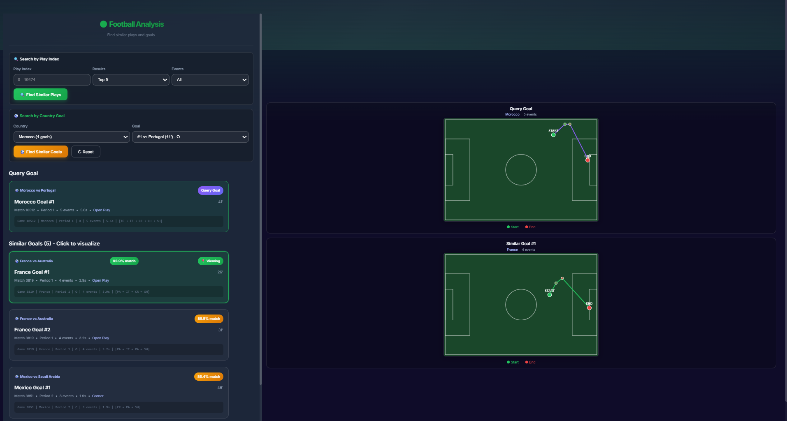
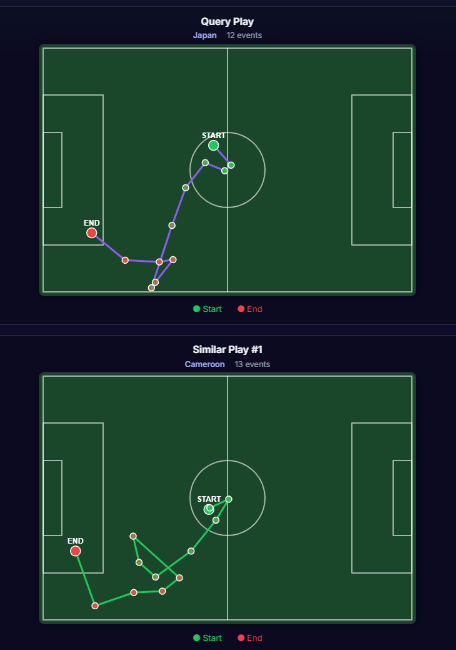

# HumFind - Song Recognition & Football Analysis Platform

A web application featuring:
1. **Song Recognition** - Identify songs from humming using DSP and AI methods
2. **Football Analysis** - Find similar plays and goals using VAE-based embeddings

## 📁 Project Structure

```
Humming/
├── backend/              # Django REST API
│   ├── humming/          # Song recognition app
│   ├── football/         # Football analysis app
│   │   ├── World_Cup/    # Match data & model outputs
│   │   ├── services.py   # Similarity service
│   │   ├── views.py      # API endpoints
│   │   └── urls.py       # URL routing
│   ├── config/           # Django settings
│   └── requirements.txt
├── frontend/             # React + Vite
│   └── vite-project/
│       └── src/
│           ├── App.jsx              # Main app with navigation
│           ├── FootballAnalysis.jsx # Football page
│           └── FootballAnalysis.css
├── dataset/              # Audio files (MP3/WAV)
└── README.md
```

## ⚠️ Prerequisites

### 1. FFmpeg (Required)

FFmpeg is required for audio processing (MP3 reading, webm conversion).

**Windows Installation:**
```bash
# Option 1: Using winget
winget install ffmpeg

# Option 2: Using chocolatey
choco install ffmpeg

# Option 3: Manual
# Download from https://ffmpeg.org/download.html
# Extract and add the bin folder to your system PATH
```

**Verify installation:**
```bash
ffmpeg -version
```

### 2. Python 3.10+ (Backend)
### 3. Node.js 18+ (Frontend)

## 🚀 Quick Start

### Backend Setup

```bash
cd backend

# Create virtual environment
python -m venv venv

# Activate (Windows)
.\venv\Scripts\activate

# Install dependencies
pip install -r requirements.txt

# Run migrations (optional, for admin)
python manage.py migrate

# Start server
python manage.py runserver
```

**Backend runs at:** http://127.0.0.1:8000

### Frontend Setup

```bash
cd frontend/vite-project

# Install dependencies
npm install

# Start dev server
npm run dev
```

**Frontend runs at:** http://localhost:5173

## 📦 Dependencies

### Backend (Python)
| Package | Purpose |
|---------|---------|
| Django | Web framework |
| librosa | Audio processing (DSP) |
| basic-pitch | AI melody detection |
| onnxruntime | AI model runtime |
| scikit-learn | Cosine similarity |
| numpy | Numerical operations |

### Frontend (Node.js)
| Package | Purpose |
|---------|---------|
| React 19 | UI framework |
| Vite 7 | Build tool |

---

## 🎵 Humming Search Feature

1. **Record** your humming or **upload** an audio file
2. Choose **DSP** (signal processing) or **AI** (neural network) method
3. Get matched songs ranked by confidence score

### Screenshots

#### Recording Function
<!-- TODO: Add screenshot of recording interface with microphone button -->


#### Upload Function
<!-- TODO: Add screenshot of file upload/drag-drop interface -->


### DSP Method
- Extracts pitch histogram and chroma features
- Fast, works offline

### AI Method  
- Uses Basic Pitch neural network for note detection
- More accurate for complex melodies

---

## ⚽ Football Analysis Feature

Analyze FIFA World Cup 2022 plays using VAE (Variational Autoencoder) embeddings to find similar possession sequences.

### Features

| Feature | Description |
|---------|-------------|
| **Play Similarity Search** | Enter a play index to find similar plays across all matches |
| **Goal Similarity Search** | Select a country and goal to find similar goal-scoring plays |
| **Trajectory Visualization** | Interactive pitch visualization showing ball movement |

### How It Works

1. **16,475 plays** extracted from 64 World Cup matches
2. **119 features** extracted per play (spatial, temporal, events)
3. **VAE model** compresses features to 32-dimensional embeddings
4. **Cosine similarity** finds the most similar plays

### Screenshots

#### Play Similarity Search
<!-- TODO: Add screenshot of play search form and results -->


#### Goal Similarity Search
<!-- TODO: Add screenshot of goal search with country/goal dropdowns -->


#### Trajectory Visualization
<!-- TODO: Add screenshot showing pitch with ball trajectory -->


### API Endpoints

| Endpoint | Method | Description |
|----------|--------|-------------|
| `/api/football/analyze/` | POST | Find similar plays by index |
| `/api/football/goals/countries/` | GET | List countries with goals |
| `/api/football/goals/country/{name}/` | GET | Get goals by country |
| `/api/football/goals/similar/` | POST | Find similar goals |

---

## ⚠️ Troubleshooting

### "No module named 'basic_pitch'" or AI not working
```bash
pip install basic-pitch onnxruntime
```

### "Could not load audio file" or MP3 errors
Install FFmpeg (see Prerequisites above)

### Python 3.12+ compatibility
- Do NOT install tensorflow
- Use onnxruntime instead (already in requirements.txt)

### Football data not loading
Ensure the following files exist in `backend/football/World_Cup/Model Outputs/`:
- `all_plays.pkl` - Pickled play objects
- `latent_representations.npy` - VAE embeddings